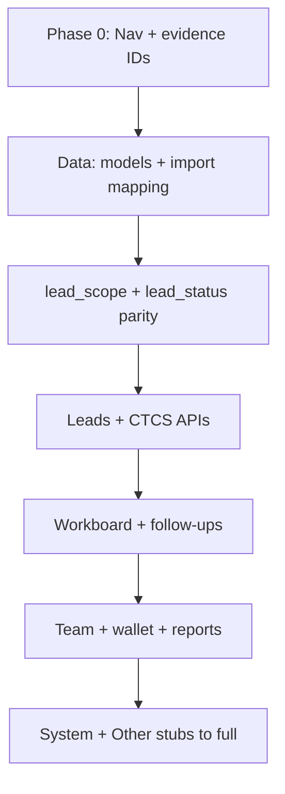

# Legacy-aligned app restructure — micro-implementation master plan

**Goal:** Ek hi jagah se samjho **purana app kahan hai**, **naya app kahan likhna hai**, aur **har PR micro-slice** kaise kaatna hai — bina poora monolith ek saath uthaye.

**Ye doc replace nahi karti:** evidence matrix (`LEGACY_PARITY_MAPPING.md`), rollout wave order (`PARITY_ROLLOUT_PLAN.md`), lossless rules (`LOSSLESS_FULLSTACK_PORT.md`), data import (`backend/legacy/LEGACY_TO_VL2_MAPPING.md`). Unko **link + execution shell** deti hai.

---

## 1. Golden rule (restructure mindset)

| Rule | Matlab |
|------|--------|
| **Legacy = spec** | Shipped Flask + SQLite behavior: `backend/legacy/myle_dashboard_main3/` + `backend/legacy/myle_dashboard/app.py` (+ `database.py` jahan schema mile). |
| **vl2 = implementation** | FastAPI routers thin; **rules** `backend/app/services/*` + **`app/core/lead_status.py`** / `lead_scope.py`. |
| **Nav / IA lock** | Sidebar + `/dashboard/...` paths sirf `frontend/src/config/dashboard-registry.ts` + `dashboard-route-roles.json` — parallel lists mat banao. |
| **Parity claim** | Sirf jab `LEGACY_PARITY_MAPPING.md` matrix row mein **Legacy ref + Evidence + New path** bhare hon; warna status **TBD/partial**. |

---

## 2. Two-stack layer map (kahan dekhna, kahan likhna)

| Layer | Purana app (read) | Naya app (write) |
|-------|-------------------|-------------------|
| **Schema / time** | `backend/legacy/myle_dashboard/database.py` (`init_db`, `migrate_db`), IST text patterns | `backend/app/models/*.py`, `backend/alembic/versions/*.py` |
| **HTTP / routes** | `myle_dashboard/app.py` (bada monolith) + `myle_dashboard_main3/routes/*.py` | `backend/app/api/v1/*.py`, aggregate `router.py` |
| **Business logic** | `helpers`, `services`, route handlers ke andar SQL | `backend/app/services/<domain>.py` — router sirf validate + auth + call service |
| **Auth / session** | Flask session, decorators | JWT / cookies — `backend/app/api/v1/auth.py`, deps |
| **Lead visibility / scope** | Legacy queries + role branches | `backend/app/services/lead_scope.py` (server final) |
| **Statuses / pipeline** | Legacy strings / `LEAD_STATUS_OPTIONS` jaisa jo mile | `backend/app/core/lead_status.py` + enums — labels parity matrix se lock |
| **UI shell** | `templates/base.html`, Jinja pages | React: `frontend/src/pages/*`, `components/*` |
| **Client ↔ API** | Form posts, `fetch` in templates | TanStack Query: `frontend/src/hooks/*`, `lib/api` patterns |
| **E2E / smoke** | Manual legacy host | `frontend/e2e/`, `tests/*.py` |

---

## 3. Legacy file index (domain → start here)

Monolith entry: **`backend/legacy/myle_dashboard/app.py`** — `/dashboard`, `/working`, `/admin/*`, bahut saari `url_for` targets yahin register.

Modular routes: **`backend/legacy/myle_dashboard_main3/routes/`**

| Domain | Primary legacy modules | Typical vl2 touchpoints |
|--------|-------------------------|-------------------------|
| Auth / login | `auth_routes.py` | `api/v1/auth.py`, login page |
| Leads CRUD / list | `lead_routes.py`, `app.py` (leads) | `api/v1/leads.py`, `services/leads_service.py`, `LeadsWorkPage`, CTCS components |
| Pool | `lead_pool_routes.py` | `lead-pool` API, `LeadPoolWorkPage` |
| Wallet | `wallet_routes.py` | `api/v1/wallet.py` / finance routers, `WalletPage` |
| Team / members | `team_routes.py` | `api/v1/team/*`, `TeamMembersPage` |
| Approvals / enrollment | `approvals_routes.py`, `enrollment_routes.py` | `team/approvals`, `enrollment-approvals` |
| Reports / daily | `report_routes.py`, `app.py` | `other/daily-report`, `team/reports`, `DailyReportFormPage` |
| Training / day2 | `training_routes.py`, `day2_test_routes.py`, `day2_eval_questions.py` | `system/training`, `analytics/day-2-report` |
| Misc / notices / leaderboard | `misc_routes.py`, `social_routes.py` | `other/notice-board`, `other/leaderboard` |
| AI / intelligence | `ai_routes.py` | `intelligence` + `meta.features.intelligence` |
| Webhooks | `webhook_routes.py` | respective service modules |

**Nav labels + paths (already exported):** `LEGACY_PARITY_MAPPING.md` → Phase 0.1 table (`NAV-EXPORT-001`).

---

## 4. vl2 folder contract (restructure without chaos)

| Concern | Location | Note |
|---------|----------|------|
| New REST endpoint | `backend/app/api/v1/<domain>.py` | Register in `router.py` if new module |
| Request/response shapes | `backend/app/schemas/*.py` | Pydantic |
| Domain rules | `backend/app/services/*.py` | **Yahi legacy `helpers` ka naya ghar** |
| Role + lead listing | `lead_scope.py`, `leads_repository.py` | List APIs ek jagah se scope lein |
| Dashboard page | `frontend/src/pages/*Page.tsx` | `DashboardNestedPage` switch se wire |
| Shared UI | `frontend/src/components/**` | Domain folders: `leads/`, `dashboard/`, etc. |
| Hooks | `frontend/src/hooks/use-*-query.ts` | Query keys stable rakho |
| Sidebar / route defs | `dashboard-registry.ts` | `surface: full \| stub`, `ui.kind` |
| Role allowlist JSON | `dashboard-route-roles.json` | Server must mirror enforce |

---

## 5. Micro-slice template (har PR — copy & fill)

**Slice id:** `SLICE-___`  
**Legacy ref:** (menu + path, jaise Phase 0.1)  
**Evidence:** (`NAV-EXPORT-001` / screenshot id / pytest name)

1. **Read (1–2 h max)**  
   - Legacy: route + helper/SQL jo is slice ke liye enough ho.  
   - vl2: existing API + page — **delete mat karo** jab tak replacement ready na ho.

2. **Behavior list (5–10 bullets)**  
   - Happy path + 2 edge cases (empty, wrong role, validation).

3. **Backend (agar slice mein data/logic hai)**  
   - Service function + thin router change.  
   - `tests/test_api_v1_*.py` — kam se kam **1** golden case + **1** forbidden role.

4. **Frontend**  
   - Sirf affected page/hook; registry tab change jab **naya path / surface** ho.

5. **Docs**  
   - `LEGACY_PARITY_MAPPING.md` matrix: status `partial` / `match` / `won’t match` + reason.

6. **Verify**  
   - `pytest` (affected), `npm run build` (frontend), optional e2e agar flow break ho sakta ho.

**Slice size:** ideally **1 legacy screen subsection** ya **1 API contract** — not “poora team dashboard”.

---

## 6. Suggested micro sequence (pehle 12 slices — old app ke risk order)

Yeh **implementation queue** hai; detailed wave labels `PARITY_ROLLOUT_PLAN.md` se match karte hain (A = core work, B = team, …).

| # | Slice | Legacy anchor (typical) | vl2 starting files | Wave |
|---|--------|---------------------------|-------------------|------|
| 1 | Leads list + scope + status labels (read path) | `/leads` + helpers | `leads_service.py`, `lead_scope.py`, `LeadsWorkPage` | A |
| 2 | Workboard buckets vs same scope as leads | `/working` | `workboard.py`, `WorkboardPage` | A |
| 3 | Follow-ups: leader/admin only, data shape | `/follow-up` | `follow-ups` API, `FollowUpsWorkPage` | A |
| 4 | Archived + recycle parity | `/old-leads`, recycle | `LeadsWorkPage` archived, `RecycleBinWorkPage` | A |
| 5 | Lead pool claim rules | `/lead-pool`, `/admin/lead-pool` | `lead_pool` API, `LeadPoolWorkPage` | A |
| 6 | Team dashboard home: “today” micro-stats | `team_dashboard` / today metrics | `execution` or new `team_home` service, `DashboardHomePage` | A/B |
| 7 | Team home wallet summary block (if product wants on home) | `/dashboard` wallet snippet | `WalletPage` data reuse + home component | D |
| 8 | Wallet page vs legacy `/wallet` | `wallet_routes.py` | `api/v1/wallet`, `WalletPage` | D |
| 9 | Daily report submit + list | `/reports/submit` | `other/daily-report` API + `DailyReportFormPage` | F |
| 10 | Live session admin vs user | `/live-session`, `/admin/live-session` | `other/live-session` API + `LiveSessionPage` | F |
| 11 | Team reports admin | `/reports` (admin) | `team/reports` stub→full | B |
| 12 | Execution APIs in shell (only if product re-opens nav) | `/admin/at-risk-leads`, … | `execution.py` + new dashboard route | E |

**Rukawat:** Slice 6–7 tab tak mat **“match”** claim karo jab tak legacy `get_today_metrics` (ya jo bhi deployed equivalent ho) ka evidence + pytest na ho.

### Sequence progress (engineering log)

| Slice | Status | Notes |
|-------|--------|--------|
| 1 — Leads list scope | **started** | Baseline tests: `test_slice1_team_list_only_creator_not_assignee`, `test_slice1_leader_list_includes_downline_created_leads` in `tests/test_api_v1_leads.py`; legacy vs vl2 team list gap noted in `LEGACY_PARITY_MAPPING.md` cross-cutting **Lead visibility** row. |
| 2 — Workboard | **started** | Baseline tests: `test_slice2_team_workboard_uses_assignment_not_creator`, `test_slice2_team_workboard_hides_unassigned_self_created_lead` in `tests/test_api_v1_workboard.py`; locks legacy `/working` assignee-style team scope in vl2 workboard endpoints. |
| 3 — Follow-ups | **started** | Added parity guard: team forbidden at API level (`backend/app/api/v1/follow_ups.py`), with regression `test_slice3_team_forbidden_for_follow_up_queue_api` in `tests/test_api_v1_follow_ups.py`; deeper queue ordering/date parity still pending. |
| 4 — Archived + recycle | **started** | Archived + recycle list now use **exact assignee scope** for non-admin (legacy-like `assigned_user_id=self` semantics for `archived_only`/`deleted_only`); restore from recycle allowed for assigned non-admin leads; admin-only permanent delete endpoint added (`DELETE /api/v1/leads/{id}/permanent-delete`) with cleanup of dependent rows. Regressions: `test_slice4_archived_*`, `test_slice4_deleted_only_*`, `test_slice4_team_*restore*`, `test_slice4_permanent_delete_*` in `tests/test_api_v1_leads.py`. |
| 5 — Lead pool claim edges | **started** | Added backend guard so only `team/leader` can claim (`POST /api/v1/leads/{id}/claim`); regressions in `tests/test_api_v1_leads.py`: `test_slice5_admin_cannot_claim_pool_lead`, `test_slice5_claim_requires_sufficient_wallet_balance`, `test_slice5_cannot_reclaim_already_claimed_lead`. |

---

## 7. Dependency sketch (kya pehle, kya baad)

**Matlab:** Pehle **data + scope + leads** stable; phir **workboard/follow-ups**; phir **team/finance**; last mein **stubs** jo product ne priority di ho.

---

## 8. Cadence (micro team ke liye)

| Rhythm | Kaam |
|--------|------|
| **Daily** | 1 slice → 1 PR (chhota) |
| **Weekly** | Wave A/B mein se **1 row** matrix `verified` / `partial` update |
| **Release** | Sirf `surface: full` + tests wale flows “done”; stubs ko “done” mat bolo |

---

## 9. File index (docs)

| Doc | Role |
|-----|------|
| `LEGACY_PARITY_MAPPING.md` | Evidence matrix + route inventory |
| `PARITY_ROLLOUT_PLAN.md` | Waves A–F + stub→full checklist |
| `LOSSLESS_FULLSTACK_PORT.md` | Backend-heavy port rules + anti-patterns |
| `CORE_APP_STRUCTURE.md` | Product journey + sidebar section lock |
| `backend/legacy/LEGACY_TO_VL2_MAPPING.md` | SQLite → Postgres + import |
| **`APP_RESTRUCTURE_MICRO_PLAN.md`** | **Ye file** — layer map + legacy index + 12-slice queue |

---

## 10. “Start today” (literally ek kaam)

1. `LEGACY_PARITY_MAPPING.md` khol kar **Parity matrix** mein **sirf ek row** chuno (jaise **Workboard**).  
2. Legacy mein `routes/` + `app.py` se us route ka handler dhundho.  
3. vl2 mein `WorkboardPage` + `GET /api/v1/workboard` trace karo.  
4. **Gap list** 5 bullets — wahi agla micro-slice hai.  
5. PR ke baad matrix update.

Isse **restructure** = controlled **slice-by-slice port**, poora rewrite nahi.

---

## 11. Replica execution board (Gap → files → tests → expected output)

**End goal:** Old app ka behaviorally equivalent replica on new stack.  
**Definition:** “Replica” claim tabhi valid jab matrix row `match` ho + regression tests pass ho.

| Priority | Gap (legacy vs vl2) | Exact files to change | Tests to add/update | Expected output (acceptance) |
|----------|----------------------|------------------------|---------------------|------------------------------|
| P0 | Team dashboard home “today” micro-stats missing (`claimed_today`, `calls_today`, `enrolled_today`) | `backend/app/services/execution_enforcement.py` (or new `team_home_service.py`), `backend/app/api/v1/execution.py`, `frontend/src/hooks/use-team-personal-funnel-query.ts` (or new hook), `frontend/src/pages/DashboardHomePage.tsx`, `frontend/src/components/dashboard/TeamHomeExecutionStrip.tsx` | `tests/test_api_v1_execution.py` (new/extend), frontend unit for home team strip rendering | Team home pe legacy-like today stats visible, values backend-driven, no hardcoded/stub numbers |
| P0 | Team leads list scope mismatch (legacy assignee execution vs vl2 creator scope on `/leads`) | `backend/app/services/lead_scope.py`, `backend/app/validators/leads_validator.py`, possibly `backend/app/services/leads_service.py`, `frontend/src/pages/LeadsWorkPage.tsx` copy/text only if needed | extend `tests/test_api_v1_leads.py` slice1 tests (team-assigned visibility + creator-not-assigned exclusion), ensure leader/admin unchanged | Team `GET /leads` same execution semantics as legacy `/leads`; no unauthorized broad visibility |
| P0 | Follow-up queue behavior incomplete (team blocked done; ordering + due/overdue discipline pending) | `backend/app/api/v1/follow_ups.py`, optional new service `backend/app/services/follow_ups_service.py`, `frontend/src/pages/FollowUpsWorkPage.tsx` | extend `tests/test_api_v1_follow_ups.py` for ordering + open_only + overdue precedence + role restrictions | Leader/admin queue order matches legacy intent (today first, then overdue/date order); team remains forbidden |
| P1 | Workboard counters/columns parity details vs legacy `/working` | `backend/app/services/workboard_service.py`, `backend/app/core/lead_status.py` (if bucket mapping differs), `frontend/src/pages/WorkboardPage.tsx` | extend `tests/test_api_v1_workboard.py` for exact bucket totals + action_counts + stale logic | Column totals and action cards match legacy stage logic for same fixture dataset |
| P1 | Status labels + transition edges not fully parity-locked | `backend/app/core/lead_status.py`, `backend/app/core/pipeline_rules.py`, `backend/app/services/ctcs_status_chain.py`, lead mutation endpoints | `tests/test_api_v1_leads.py`, `tests/test_api_v1_ctcs.py` edge-case matrix (invalid jumps, role gates, terminal states) | Same transition allow/deny outcomes as legacy for key states; error responses deterministic |
| P1 | Wallet summary parity on team home and finance coupling | `backend/app/api/v1/wallet.py`, `backend/app/api/v1/finance.py`, `frontend/src/pages/WalletPage.tsx`, `frontend/src/pages/DashboardHomePage.tsx` | `tests/test_api_v1_wallet.py`/`finance` tests (add if missing), frontend render tests | Team sees legacy-equivalent wallet summary blocks on home and finance pages with matching computed fields |
| P2 | Daily report/report compliance parity | `backend/app/api/v1/other.py` (daily report endpoints), `backend/app/api/v1/team.py` (report stats), `frontend/src/pages/DailyReportFormPage.tsx`, `frontend/src/pages/TeamReportsPage.tsx` | extend `tests/test_api_v1_other_notice_board.py` / `tests/test_api_v1_team_reports.py` with report lifecycle cases | Submit/edit/view/reporting stats flow matches legacy role behavior and date semantics |
| P2 | Live session user/admin split parity | `backend/app/api/v1/other.py`, `backend/app/api/v1/settings.py`, `frontend/src/pages/LiveSessionPage.tsx` | add/extend tests for admin edit + user read paths | Admin can manage session config; team/leader consume same values as legacy |
| P2 | Notice board / leaderboard semantics parity | `backend/app/api/v1/other.py`, `frontend/src/pages/NoticeBoardPage.tsx`, `frontend/src/pages/LeaderboardPage.tsx` | extend existing other-route tests for ordering/visibility | Feed ordering and role visibility match legacy expectations |

### Replica checklist per slice (mandatory)

1. Add/refresh row in `docs/LEGACY_PARITY_MAPPING.md` with evidence id.
2. Add backend regression test(s) first (or with change).
3. Implement behavior in service layer, keep API/router thin.
4. Wire frontend only after backend contract is stable.
5. Mark matrix row `partial` or `match` (never silent parity claim).

### Suggested next three slices (immediate)

1. **Slice 4:** Archived + Recycle parity (`/old-leads`, `/leads/recycle-bin`).
2. **Slice 5:** Lead pool claim edge rules parity.
3. **Slice 6:** Team home today stats parity (highest user-visible mismatch).

---

## 12. Team role parity checklist v1 (old app baseline -> vl2 gap map)

Reference baseline used:
- `backend/legacy/myle_dashboard/app.py` (`team_dashboard`, `working`)
- `backend/legacy/myle_dashboard_main3/routes/lead_routes.py` (`/leads`, `/follow-up`, `/old-leads`)
- `backend/legacy/myle_dashboard_main3/routes/wallet_routes.py` (`/lead-pool`, `/lead-pool/claim`)
- `backend/legacy/myle_dashboard_main3/services/rule_engine.py` + `helpers.py` (team status permissions)

| Area (team-first order) | Legacy team behavior (source-locked) | vl2 current state | Gap / next micro action |
|---|---|---|---|
| Dashboard home (`/dashboard`) | Team sees personal execution surface + today counters (`claimed`, `calls`, `enrolled`), follow-up queue hidden for team | Team execution strip already wired (`/api/v1/execution/personal-funnel`), team follow-up hidden/gated | **Gap:** today micro-stats parity + exact home copy/layout still not 1:1; implement dedicated team-home stats contract + UI block |
| My Leads list (`/leads`) | Team execution scope is assignee/stale-worker/current-owner aware (not pure creator-only) | Slice-1 started; vl2 cross-cutting note still tracks creator-vs-execution mismatch risk | **Gap:** finish strict execution-scope lock for team list and keep leader/admin unchanged |
| Workboard (`/working`) | Team board is own-work scoped; actionable focus pre-Day1, Day1+ mostly read/handoff | Team workboard assignment tests added; batch link flow now token-completion based (purple until complete, then auto green) | **Gap:** verify final bucket math/text parity against legacy labels and counters (small UI/wording drift) |
| Follow-up queue (`/follow-up`) | Team blocked; only leader/admin queue | Implemented: team forbidden at API + FE gating (slice-3) | **Gap:** leader/admin ordering and overdue semantics still to match exactly; keep team block fixed |
| Archived + recycle (`/old-leads`, recycle) | Team sees execution-scope archived/deleted leads and restore constraints | Implemented partial (slice-4): assignee-style scope + restore behavior + admin permanent delete | **Gap:** template-level wording and minor UX behavior parity polish |
| Lead pool (`/lead-pool`) | Team claim gated by proof/stale checks, daily cap + cooldown, wallet sufficiency | Implemented partial (slice-5): role guards + wallet insufficiency + reclaim prevention | **Gap:** legacy daily cap + cooldown + team gate message nuance still pending in vl2 |
| Team status dropdown/editing | Team cannot directly set Day1+ statuses; only allowed pre-Day1 + exits | Role-based restrictions exist in vl2 but need final old-string validation sweep | **Gap:** run one pass to confirm exact allowed set + label aliases on all edit surfaces |

### Execution order from this checklist (team-bottom-up)

1. Team dashboard today-stats parity (highest visible mismatch)  
2. Team leads execution scope hard-lock  
3. Workboard bucket/copy parity polish  
4. Follow-up ordering semantics (team rule stays locked)  
5. Lead-pool cooldown/daily-cap + team gate messages  
