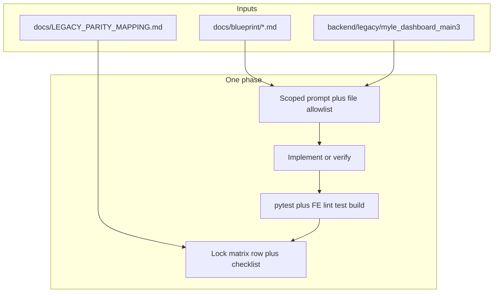
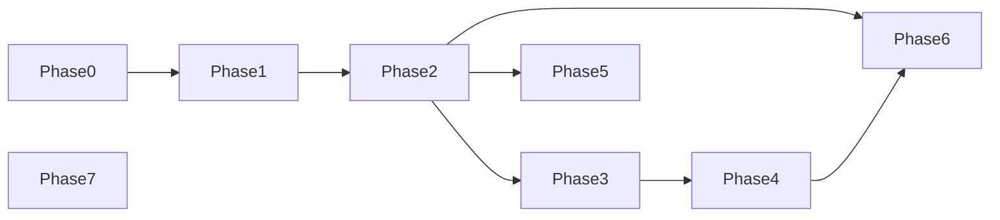

# Controlled build pipeline (phased prompts + gates)

Single entry point for **sequenced** AI-assisted work on Myle vl2: blueprint → scoped prompts → verify → lock. This repo is **not** greenfield; extend canonical paths under `backend/app/` and document parity in [`LEGACY_PARITY_MAPPING.md`](LEGACY_PARITY_MAPPING.md).

**Artifacts:** Phase 0 schema audit → [`PHASE_0_SCHEMA_GAP_LIST.md`](PHASE_0_SCHEMA_GAP_LIST.md). Auth blueprint vs code → [`PHASE_1_AUTH_GAP_MAP.md`](PHASE_1_AUTH_GAP_MAP.md).



## Non-negotiables

### Master rule (every phase)

- **Do not modify existing files unless explicitly listed** in that phase’s [`build-prompts/PHASE_XX.md`](build-prompts/) **Allowed paths** section.
- **Follow existing contracts strictly** — lead status / pipeline: [`backend/app/core/lead_status.py`](../backend/app/core/lead_status.py), [`backend/app/core/pipeline_rules.py`](../backend/app/core/pipeline_rules.py), [`docs/blueprint/04_lead_pipeline_constants.md`](blueprint/04_lead_pipeline_constants.md). No invented stages or labels.
- **No assumptions** — behavior matches **legacy** where parity is claimed; otherwise document in [`LEGACY_PARITY_MAPPING.md`](LEGACY_PARITY_MAPPING.md) as `won't match (reason)`.

### Master rule (operationalized)

1. **Explicit file list** per phase — only paths in that phase’s [`build-prompts/PHASE_XX.md`](build-prompts/) (plus tests named there).
2. **Explicit contract reads** before editing: [`backend/app/core/lead_status.py`](../backend/app/core/lead_status.py), [`docs/blueprint/04_lead_pipeline_constants.md`](blueprint/04_lead_pipeline_constants.md), etc.
3. **No schema drift:** new column → SQLAlchemy model **and** Alembic revision.

Lock step: [`docs/MYLE_VL2_CHECKLIST.md`](MYLE_VL2_CHECKLIST.md) ticks **and** parity matrix when claiming legacy match.

### Repo rules

- **Parity claims** require a matrix row with Legacy ref + Evidence in [`LEGACY_PARITY_MAPPING.md`](LEGACY_PARITY_MAPPING.md) ([`docs/LEGACY_100_PARITY_LOCK.md`](LEGACY_100_PARITY_LOCK.md)).
- **API surface:** register new HTTP routes only in [`backend/app/api/v1/<domain>.py`](../backend/app/api/v1/) and [`backend/app/api/v1/router.py`](../backend/app/api/v1/router.py) — see [`.cursor/rules/myle-backend-api.mdc`](../.cursor/rules/myle-backend-api.mdc).
- **Schema changes:** SQLAlchemy model + Alembic revision; never hand-edit production DB without a migration story.
- **Frontend shell:** dashboard routes and home copy stay aligned with [`frontend/src/config/dashboard-registry.ts`](../frontend/src/config/dashboard-registry.ts) (see workspace dashboard rule).

## Reality check: vl2 layout (do not duplicate)

| Concern | Canonical location |
|---------|---------------------|
| App entry, health | [`backend/main.py`](../backend/main.py) — `GET /health`, `/health/db`, `/health/migrations` |
| API aggregate | [`backend/app/api/v1/router.py`](../backend/app/api/v1/router.py) — prefix `/api/v1` |
| Models | [`backend/app/models/`](../backend/app/models/) — not a monolithic `models.py` |
| DB session | [`backend/app/db/session.py`](../backend/app/db/session.py) — async SQLAlchemy |
| Auth deps | [`backend/app/api/deps.py`](../backend/app/api/deps.py) — `require_auth_user`, `AuthUser` |
| IST | [`backend/app/core/time_ist.py`](../backend/app/core/time_ist.py) |
| Legacy monolith (spec) | [`backend/legacy/myle_dashboard_main3/`](../backend/legacy/myle_dashboard_main3/) |

## Phase map (0–7)

Copy-paste prompts live in [`docs/build-prompts/`](build-prompts/). Each file lists **preflight**, **allowed paths**, **forbidden**, **verify**, **lock**.

| Phase | Goal | Behavior spec (read) | vl2 touch surfaces (typical) |
|-------|------|----------------------|------------------------------|
| **0** | Contracts / schema audit vs blueprint; no new business logic unless gap is proven | [`blueprint/02_database_schema.md`](blueprint/02_database_schema.md), [`04_lead_pipeline_constants.md`](blueprint/04_lead_pipeline_constants.md) | `app/models/`, `app/core/lead_status.py`, Alembic `backend/alembic/versions/` |
| **1** | Auth parity: login rules, register, upline, pending/blocked | [`blueprint/03_roles_and_auth.md`](blueprint/03_roles_and_auth.md), legacy auth routes | `app/api/v1/auth.py`, `app/schemas/auth.py`, `app/models/user.py`, `app/services/login_identity.py` |
| **2** | Lead FSM — transitions, role gates, status↔stage | [`05_leads_crud.md`](blueprint/05_leads_crud.md), [`04_…`](blueprint/04_lead_pipeline_constants.md) | `app/api/v1/leads.py`, `pipeline_rules.py`, `services/rule_engine.py` / `lead_scope.py` |
| **3** | Workboard aggregation, pagination, scope | [`06_workboard.md`](blueprint/06_workboard.md) | `app/api/v1/workboard.py`, `lead_scope.py` |
| **4** | Wallet + pool atomicity, idempotency | [`07_lead_pool.md`](blueprint/07_lead_pool.md), [`09_wallet.md`](blueprint/09_wallet.md) | `app/api/v1/wallet.py`, `app/api/v1/leads.py` (claim), `app/services/wallet_ledger.py`, `models/wallet_ledger.py` |
| **5** | Training unlock, test, certificate | [`10_training.md`](blueprint/10_training.md) | `app/api/v1/system.py`, training-related models/migrations as added |
| **6** | Daily reports + scoring dedupe | [`11_daily_reports.md`](blueprint/11_daily_reports.md) | `scoring_service.py`, new or extended routers — only as listed in PHASE_06 |
| **7** | Admin insights, stubs → full, feature flags | [`PARITY_ROLLOUT_PLAN.md`](PARITY_ROLLOUT_PLAN.md), [`LEGACY_PARITY_MAPPING.md`](LEGACY_PARITY_MAPPING.md) | `app/api/v1/execution.py`, `meta`, `other_pages.py`, etc. per allowlist |

### Phase mapping with exit gates (minimum before next phase)

| Phase | Exit gate |
|-------|-----------|
| **0** | `pytest`; migrations apply; gap list reviewed ([`PHASE_0_SCHEMA_GAP_LIST.md`](PHASE_0_SCHEMA_GAP_LIST.md)) |
| **1** | Auth paths tested ([`PHASE_1_AUTH_GAP_MAP.md`](PHASE_1_AUTH_GAP_MAP.md)); login/register flows match scope |
| **2** | FSM / team restriction tests green; invalid transitions rejected |
| **3** | Workboard API + scope sanity |
| **4** | Wallet idempotency + claim atomicity (e.g. row lock on claim); 402 paths tested |
| **5** | Training rules + IST in tests where applicable |
| **6** | Report/scoring dedupe |
| **7** | Admin-only + feature flags |

### Dependency order

Execute **0 → 1 → 2 → 3 → 4** in order. **5** and **6** depend on **2** (and **6** may depend on **4** for money-related scoring). **7** promotes admin/stub surfaces last — do not rewrite core FSM from intelligence routes.



## Per-phase template (what each `PHASE_XX.md` contains)

1. **Preflight** — files to read before editing.
2. **Prompt** — short goal paragraph to paste into the AI.
3. **Allowed paths** — only these may be modified (plus tests explicitly named).
4. **Forbidden** — e.g. “do not change lead_status constants without product sign-off.”
5. **Verify** — commands; all must pass before lock.
6. **Lock** — update parity matrix / checklist; PR description cites phase id.

## Verification gates (minimum)

Run from repo root unless noted.

```bash
# Backend
cd backend && pytest

# Frontend (when FE touched)
cd frontend && npm run lint && npm run test && npm run build
```

CI mirrors these in [`.github/workflows/ci.yml`](../.github/workflows/ci.yml). Use [`docs/MYLE_VL2_CHECKLIST.md`](MYLE_VL2_CHECKLIST.md) for feature-level ticks.

## Failure control

- If **verify** fails: **stop** — do not start the next phase. Fix within the same phase.
- Re-run with a **delta prompt**: failing test name + log snippet + unchanged allowlist unless scope must expand (document why).
- **Do not merge** wallet/FSM-heavy changes with unrelated phases in one PR.

## What not to do (repo-specific)

- Do **not** add a second API prefix or duplicate [`GET /health`](../backend/main.py) without product reason.
- Do **not** collapse models into one `models.py`; keep [`backend/app/models/`](../backend/app/models/) and Alembic.
- Do **not** implement wallet or pool **before** lead FSM and scope are understood — verify Phase 2, then harden Phase 4.
- **Frontend:** UI does not own status or wallet math — server rules in API ([`LEGACY_PARITY_MAPPING.md`](LEGACY_PARITY_MAPPING.md)).

## Optional next iterations

- **QA prompt pack** — e.g. `docs/build-prompts/QA_FSM.md`, `QA_WALLET.md` (contract tests only).
- **Deploy** — [`blueprint/01_stack_and_setup.md`](blueprint/01_stack_and_setup.md), Render/hosting rules in repo; do not duplicate a second deploy story here.

## See also

- Blueprint index: [`docs/blueprint/00_INDEX.md`](blueprint/00_INDEX.md)
- Side-by-side rollout: [`docs/PARITY_ROLLOUT_PLAN.md`](PARITY_ROLLOUT_PLAN.md)
